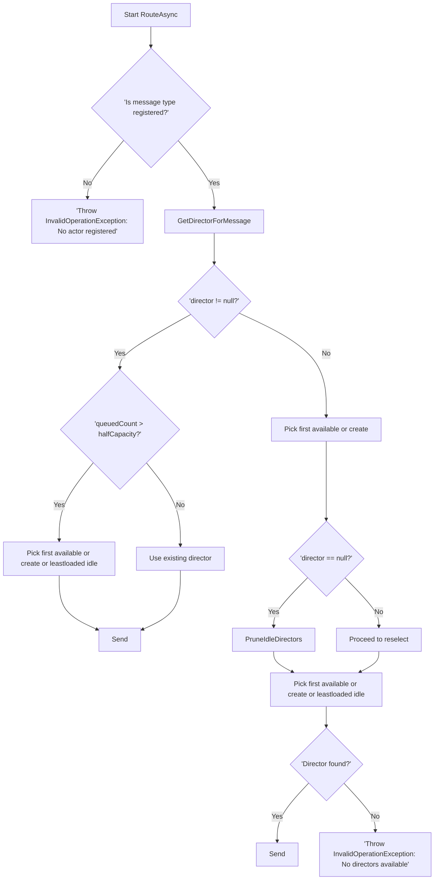
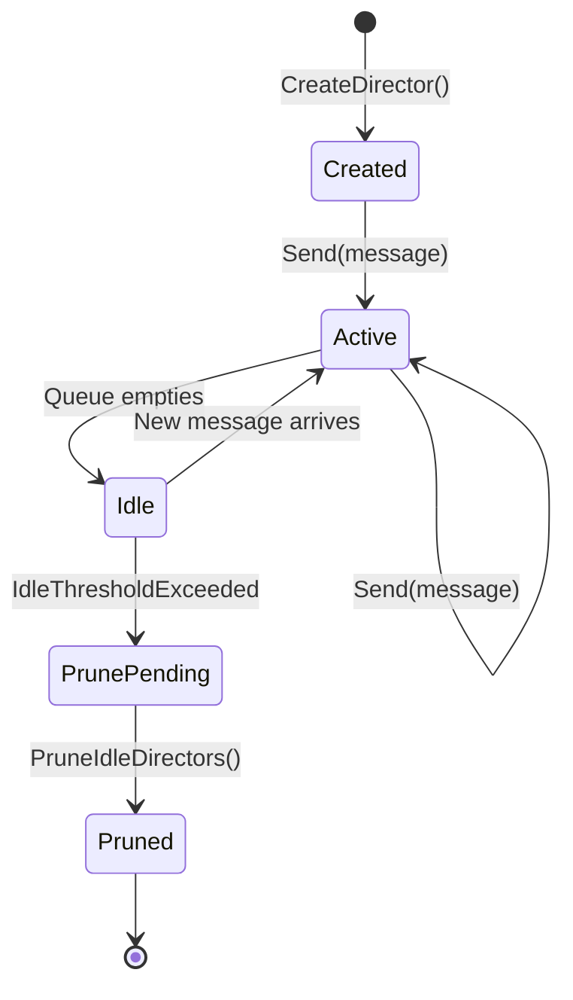

# Actor Framework Demo and Sample Applications

## Overview

This repository provides a lightweight, host-agnostic actor framework built on .NET 9.0. It includes:  
- A core **ActorFramework** library for defining actors, mailboxes, directors, and workspaces  
- An **ActorSystem** ASP.NET Web API showcasing ContestActor and PropositionActor with Serilog and OpenAPI  
- An **ActorWorkspace** runtime extension for alternative workspace implementations  

Actors process immutable messages in parallel, using directors to balance load and isolate failures. The framework offers backpressure, retry policies, idle-director pruning, and JSON polymorphism for message types.

---

## Prerequisites

- .NET 9.0 SDK  
- (Optional) Visual Studio 2022 or VS Code  
- Internet access to restore NuGet packages  

---

## Getting Started

1. Clone the repo  
   ```bash
   git clone https://github.com/mak100186/actor-pattern.git
   cd actor-framework-demo
   ```

2. Build all projects  
   ```bash
   dotnet build
   ```

3. Run the ActorSystem API  
   ```bash
   cd ActorSystem
   dotnet run
   ```

4. In development mode, browse Swagger UI:  
   `https://localhost:5001/swagger/index.html`  

---

## Configuration (`appsettings.json`)

```json
{
  "ActorFrameworkOptions": {
    "DirectorIdleThresholdForPruning": 30,
    "MaxDegreeOfParallelism": 10,
    "MailboxCapacity": 1000,
    "MailboxOverflowPolicy": "BlockProducer",
    "MailboxType": "ConcurrentQueue",
    "RetryCountIfExceptionOccurs": 3,
    "ShouldStopOnUnhandledException": true
  },
  "Serilog": {
    "MinimumLevel": "Information",
    "WriteTo": [ { "Name": "Console" } ]
  }
}
```

- **DirectorIdleThresholdForPruning**: seconds to keep idle directors before removing  
- **MaxDegreeOfParallelism**: maximum concurrent directors per workspace  
- **MailboxCapacity** & **OverflowPolicy**: controls backpressure or drops  

---

## API Endpoints

All endpoints reside under `/Workspace`:

- **GET** `/Workspace/SendContestMessage?key={key}`  
  Enqueue a `ContestMessage` with the given key.

- **GET** `/Workspace/SendPropositionMessage?key={key}`  
  Enqueue a `PropositionMessage` with the given key.

- **GET** `/Workspace/SendMessages?countOfMessagesToGenerate={n}`  
  Sends _n_ alternating contest/proposition messages.

- **GET** `/Workspace/PruneWorkspace`  
  Triggers idle-director pruning immediately.

- **GET** `/Workspace/WorkspaceState`  
  Returns current workspace state, including all director and actor statuses.

Example:

```bash
curl "https://localhost:5001/Workspace/SendContestMessage?key=abc123"
```

---

## Architecture

### Load Balancing Algorithm



This flow ensures messages route to existing directors when possible, create new directors up to the parallelism limit, or reuse the least-loaded idle director under high load.

### Director State Lifecycle



Directors bootstrap one thread on creation, become busy when they receive messages, transition to idle when their queues drain, and eventually get pruned if idle too long.

---

## How is concurrency handled in the actor model?

**Director** is dispatching actor messages via a single-threaded loop (e.g. using a `Task.Run`): it's effectively **scheduling actors on one thread**, even if the actors themselves are async.

---

### What the Director Is Doing

- ✅ It’s **single-threaded** in terms of scheduling.
- ✅ It ensures **message ordering** and **non-concurrent dispatch**.
- ✅ It avoids race conditions between actors.

---

### But What About Actor Execution?

If `DispatchToActor` is async and actors do I/O or await tasks:

- The **scheduling** is single-threaded.
- The **execution** of actor logic may hop threads (via `await`), but each actor still processes messages sequentially.
- You’re not blocking the thread—just sequencing the work.

---

### Analogy: Like a Mailroom Clerk

Think of the director as a clerk who hands out mail (messages) to actors one at a time. Even if the actors go off and do async work, the clerk doesn’t hand out the next message until the previous one is "accepted" (i.e. dispatched).

---

### Why This Matters

- ✅ Preserves **actor isolation**.
- ✅ Avoids **concurrent access** to actor state.
- ✅ Makes **metrics and tracing** easier (you know exactly when and where messages are dispatched).

---

## Extending the Framework

1. **Add a new message type**  
   - Create `MyMessage : IMessage`  
   - Implement `IActor` (e.g. `public class MyActor : IActor`)  
   - Register in `Program.cs`:  
     ```csharp
     actorBuilder.AddActor<MyActor, MyMessage>();
     ```

2. **Customize mailbox or retry behavior**  
   - Adjust **MailboxCapacity**, **OverflowPolicy**, **RetryCountIfExceptionOccurs**  
   - Swap in a custom `IMailbox` by updating the `Director.RegisterActor` logic.

3. **Instrumentation & events**  
   - Subscribe to `IEventBus` events (`ActorIdleEvent`, `DirectorReceivedMessageEvent`, etc.)  
   - Expose additional diagnostics via controllers or health checks.

---

## Testing

| Aspect | What to Verify | 
|-----------------|------------------|
| Parallelism | Messages are processed concurrently | 
| Thread Isolation | Each message runs on a distinct thread | 
| Actor/Director Identity | Correct actor and director IDs are used | 
| Workspace Consistency | All processing occurs within the same workspace | 
| Message Completion | All messages are processed without loss or duplication | 

---

## Observability & Diagnostics

- **Serilog** logs all actor processing, retries, and pruning events.  
- **WorkspaceState** endpoint shows real-time queue lengths, pause states, and last activity timestamps.  
- **EventBus** publishes POCO events for integration with external monitoring.

---

## Contributing

Contributions are welcome! Please submit pull requests to:

1. Follow the existing coding style and naming conventions.  
2. Add or update unit tests for new features.  
3. Document changes in this README.

---

## License

This project is licensed under the MIT License. See [LICENSE](LICENSE.md) for details.
